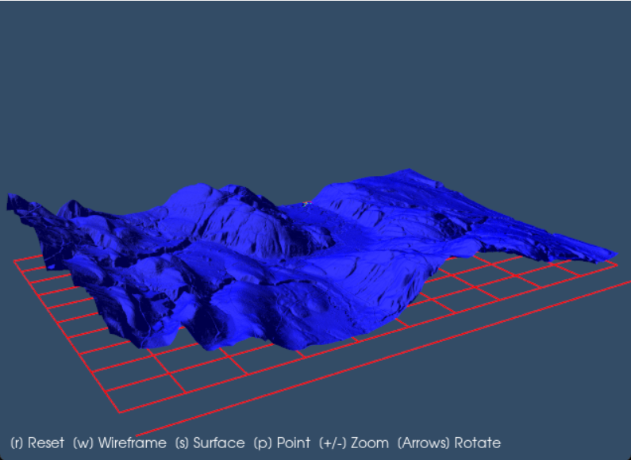

# DEMViz





A Python package for visualizing Digital Elevation Models (DEMs) using VTK with a map grid overlay based on the DEM's projection.

## Installation

```bash
pip install demviz
```

### Build

Make sure to install build package

`pip install hatchling build`

Build wheel and tar by :

`python -m build --no-isolation`

Install locally:

`pip install dist/demviz-0.1.0-py3-none-any.whl`

## Development

### Test package

`python -m unittest discover tests`

## Usage

`demviz dem_file.tif --z-scale 1.0 --grid-spacing 1000`

or

`demviz dem_file.tif --z-scale 1.0`

---

> This project uses OpenCV (Apache 2.0), VTK (BSD 3-Clause), and Python (PSFL). See third_party/ for license details.